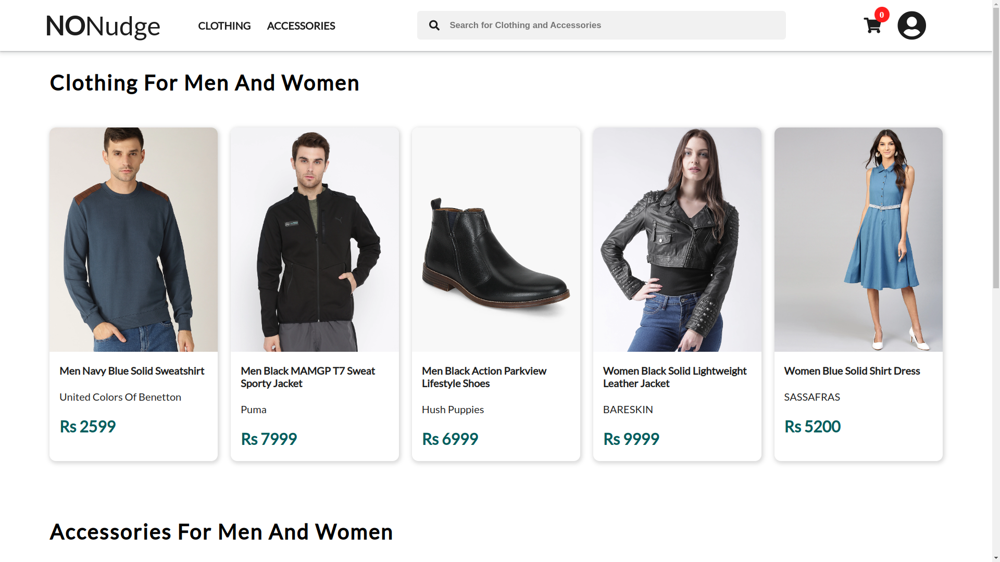
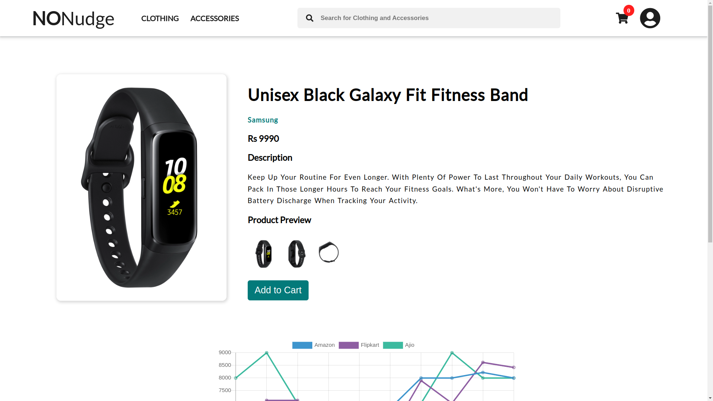
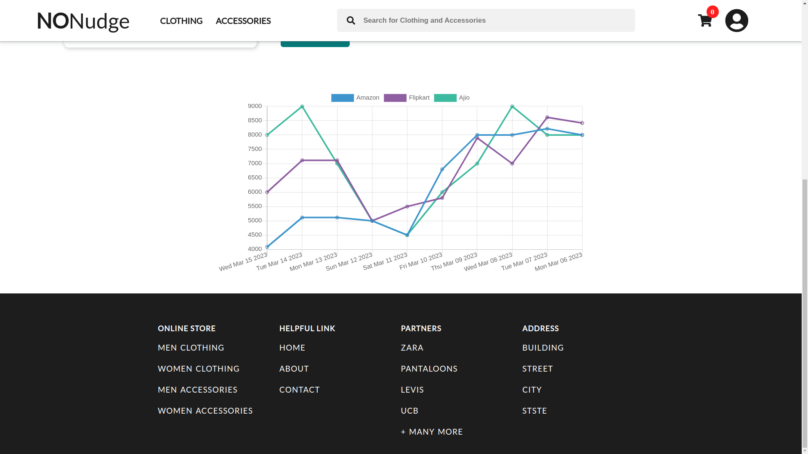

# NONudge
Codebase can be found at [https://github.com/akashkb-a01/NONudge](https://github.com/akashkb-a01/NONudge)  

NONudge (deployed at [https://nonudge.netlify.app/](https://nonudge.netlify.app/)) is an e-commerce site that for the moment is limited to only clothing and accessories and boasts of having no nudges (or so the developer believes!). The site does not use any nudges, such as product recommendations, social proof, deceptive discounting and scarcity tactics. Below we discuss a few salient features of the site

## Clean  

  

Overall, the site's user interface is clean and easy to navigate. By clean ui, we mean no pop-ups, dynamically moving sliders, colorful labels etc. The products are organized into categories and subcategories, making it easy for users to find what they are looking for.
Also, the site does not provide any product recommendations. Product recommendations can act as a nudge for users hence defying the purpose of the project.

## Unbiased  

  

There is no use of social proof on the website. Customer reviews and ratings are examples of social proof that can be used to increase credibility and trust among users, but they can also be readily manipulated by publishing biased opinions, which again might influence potential customers.
Moreover, the website does not employ any scarcity strategies. Using scarcity strategies, such as time-limited deals and low-stock alerts, can evoke a sense of urgency and persuade customers to make a purchase.

## Selling price only    

    

The site only shows the selling price of the product. By doing so, the site tackles the notorious practice of deceptive discounting followed by almost any other e-commerce site on the planet. 
Also, the customers are shown the selling price graph trend from a few leading e-commerce sites over the last 10 days. Although it would not have taken much effort to build a recommender based on the past prices, wouldn’t that also count as a nudge?
